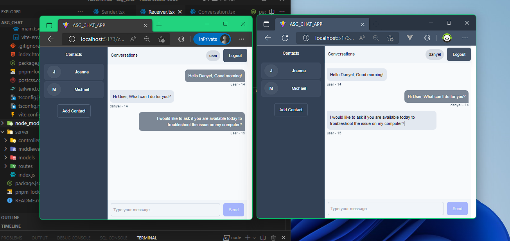

# ASG CHAT APP (Assessment)

## Development tools used

    - pnpm (package manager)
    - vite (build tool)
    - nodemon (node server runner)

---

## Packages Installed

### BACKEND

    - express
    - express-session
    - socket.io
    - body-parser
    - cookie-parser
    - cors
    - mongoose
    - bcrypt
    - passport
    - passport-local

### FRONTEND

    - typescript
    - axios
    - react
    - react-router-dom
    - socket.io-client
    - tailwindcss (css styling)

---

## Setup (Server)

Start Server

```bash
    nodemon .
    # or
    nodemon server/index.js
```

---

## Setup (Client)

Install dependencies

```bash
pnpm install
```

Start Client on development

```bash
pnpm run dev
```

Build app

```bash
pnpm run build
```

---

## Sample GUI

Login Page


Registration Page


Coversation Page


---

## Author

[Daniel Lozada](https://github.com/adazol123)
